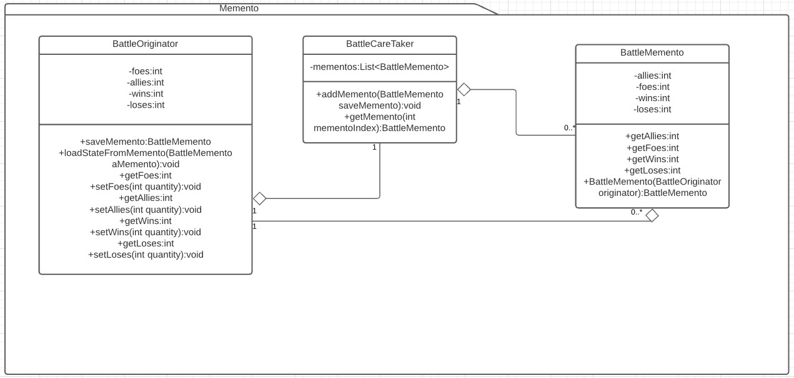

## Memento
Es un patron de comportamiento (behavioral). [Link descripcion](https://sourcemaking.com/design_patterns/memento)

Memento se apoya en una construcción de objetos caretaker, originator y memento, donde el originator genera mementos(con la información necesaria para restaurarse en el futuro) y luego 
en algún momento de la ejecución el caretaker puede volver a pasarle el memento al originator
que usara la información del mento para reestablecerse a un estado anterior.

## Diagrama de clases

## SOLID
* Single responsibility

La responsabilidad del originator debe estar bien modelada, ya que esta no depende del patron (salvo por los metodos save y load memento). Por otro lado las responsabilidades del Caretaker y del memento son intrinsecamente 1 el caretaker debe almacenar y devolver mementos, mientras que el memento debe tener los datos necesarios para que el originator pueda volver a un estado anterior. Por lo tanto este principio se cumple.

* Open/Close principle

Dado un buen diseño, no debería haber conflicto en un sistema de mementos, si necesitamos un originator que funcione distinto podemos heredarlo (aunque luego tendremos que tener cuidado con el principio de Liskov por como interactua con caretaker y memento), aunque también podemos heredar mementos y caretaker para que jueguen bien con el principio Liskov, este principio hay que tener cuidado al implementarlo para que se cumpla correctamente.

* Liskov substitution 

Como comente anteriormente, hay que tener cuidado a la hora de extender el originator para que siga funcionando con los mementos y caretaker originales, si tenemos que heredar o interfacear con nuevos mementos porque los originales no funcionan estariamos rompiendo con este principio.

* Interface Segregation

En el ejemplo que desarrolle es muy pequeño y no hay interfaces, pero si el originator se complejiza y necesita segregarse entiendo que se volveria bastante complicado de manejar el load basado en mementos, diría que este principio no es tan compatible con memento.

* Dependency inversion

Por lo que entiendo el memento debe ser construido cuidadosamente para que contenga todas las variables necesarias para poder restaurar el originator a un estado anterior por lo que seguramente habra una alto acoplamiento entre el originator y un memento, casi seguramente que uno de los dos debe conocer la clase concreta del otro ya sea porque el memento se crea recibiendo un originator en su constructor o el originator setea todos los datos del memento alguno debe conocer la clase concreta del otro no veo como funcionaria con interfaces. 